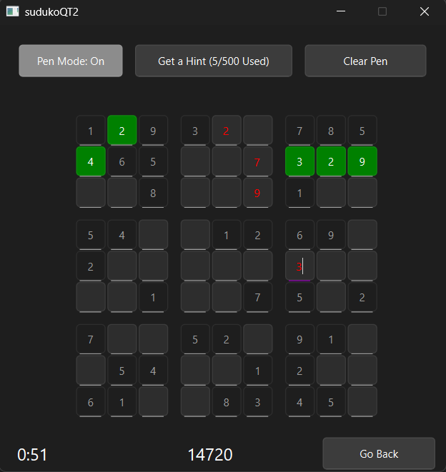
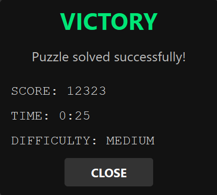

# 🧩 Sudoku Game with Pen Feature

A modern, feature-rich Sudoku game built using Qt, featuring multiple difficulty levels and an innovative **pen mode** to enhance your puzzle-solving experience.

---

## 🚀 Features

- **🧠 Multiple Difficulty Levels**  
  Choose from Easy, Medium, or Hard puzzles to match your skill level.

- **✏️ Pen Mode**  
  Visualize potential numbers in cells without committing to them—perfect for planning strategies.

- **💡 Hint System**  
  Stuck? Use limited hints based on difficulty to get a nudge in the right direction.

- **🏆 Score Tracking**  
  Earn points based on puzzle difficulty, speed, and accuracy.

- **⏱ Time Tracking**  
  Keep track of how long it takes to solve each puzzle.

- **🌙 Sleek Dark Theme**  
  Designed for comfort during long play sessions.

---

## ✏️ Pen Mode Explained

The pen mode is the standout feature of this Sudoku game. It helps players:

- Mark possible values in cells without making permanent changes
- Switch between normal mode and pen mode with a single click
- Visualize advanced strategies and reduce mistakes
- Experiment with different approaches before committing

---

## 🧱 Game Structure

The game follows a clean architecture separating logic from UI:

- **`SudokuBoard`**  
  Manages the 9×9 grid and enforces all game rules.

- **`Player`**  
  Tracks the game state, handles scoring, and validates moves.

- **`Viewer`**  
  Handles user input and displays the UI using Qt.

---

## 📊 Data Structures Used

- **2D Arrays**  
  Represent the 9×9 game board.

- **Constraint Graph**  
  Helps enforce Sudoku rules and calculate domains.

- **UnorderedSet**  
  Used for fast domain value storage.

- **Map with Set**  
  Efficiently stores pen marks per cell.

---

## 🎮 How to Play

1. Choose a difficulty level from the main menu.
2. Use number keys (1–9) to fill in the cells.
3. Toggle **Pen Mode** to jot down possible values.
4. Use hints sparingly—each difficulty level gives a limited number.
5. Fill in all cells correctly to solve the puzzle!

---

## ⌨️ Controls

| Key / Button       | Action                                  |
|--------------------|------------------------------------------|
| Number Keys (1–9)  | Enter a value in the selected cell       |
| Backspace/Delete   | Clear a cell                             |
| Pen Mode Button    | Toggle pen mode on/off                   |
| Clear Pen Button   | Remove all pen marks                     |
| Hint Button        | Receive a hint for a tricky cell         |
| Back Button        | Return to the main menu                  |

---

## 🛠 Development Stack

- **Language**: C++  
- **Framework**: Qt for GUI  
- **Custom Structures**: For efficient board and logic operations

---

## 🖼 Screenshots

---

## 🌟 Future Enhancements

- Customizable themes
- Puzzle saving & loading
- Online leaderboards and stats

---

## 🙌 Credits

Project done by Abdelrahman AboIsmaiel, Yassien Ibrahim, Jana Ahmed, Anasalla Eldamanhoury, and Farida Hazem.
